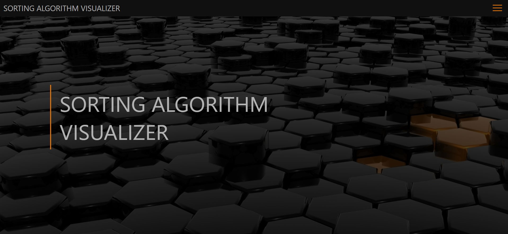

# Sorting Algorithm Visualizer

## Live Demo

Coming soon

## Overview

Sorting Algorithm Visualizer provides visualizations of common sorting algorithms, along with complexity tables, code implementations in JavaScript, and descriptions of each one's advantages and disadvantages. This program is intended to be used as an educational tool and currently supports 5 algorithms, but more may be added in the future. So far, the available algorithms are quick sort, merge sort, bubble sort, selection sort, and insertion sort.

## Animation Details

No animation library is used. Instead, the general framework of the visualization is as follows:

The sorting functions are executed synchronously on the stateful array `barsToRender`, sorting the input and returning an animation queue. Each element in the input array gets mapped to a VisualizerBar component to be displayed. The returned animation queue is filled with animation objects which are inserted at the appropriate points in the sorting procedure to be handled by the async function `animateArrayUpdate`. From there, the queue is looped through to visually update the display. This entails updating the highlighted indices which represent which item(s) are being sorted on that iteration, staggering the animation with setTimeouts, and physically rearranging the bars into their sorted positions.

## To Do

- Refactor setTimeout code to requestAnimationFrame for smoother animations and less clutter on the event loop
- Add more sorting algorithms

## Technologies Used

React 
React Hooks 
React Router 
SASS 
SCSS Modules 
Intersection Observer API 

## License

Licensed under the [MIT License](LICENSE)
